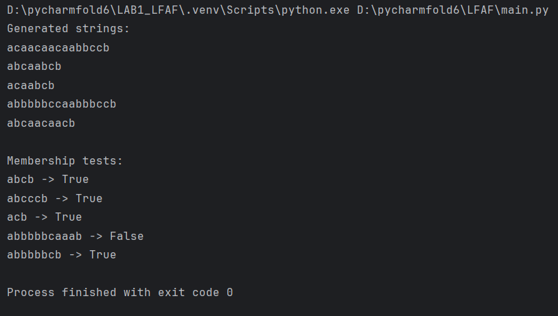

# Laboratory Work 1

**Course:** Formal Languages & Finite Automata  
**Author:** Cuibari Vladislav FAF-243

## Theory

A formal language is a set of strings formed from a finite alphabet according to specific rules. Unlike natural languages, formal languages have precise definitions suitable for mathematical analysis and computation. A formal grammar consists of non-terminal symbols, terminal symbols, a start symbol, and production rules. Grammars generate strings by starting from the start symbol and applying production rules until only terminals remain. A finite automaton recognizes strings by processing input symbols through state transitions. It accepts a string if it ends in a final state after consuming all input. Regular grammars can be directly converted to finite automata, establishing equivalence between generative and recognitive approaches.

## Objectives

1. Discover what a language is and what it needs to have to be considered a formal one
2. Provide the initial setup for the evolving project
3. According to the variant number, get the grammar definition and do the following:
   - a. Implement a type/class for your grammar
   - b. Add one function that would generate 5 valid strings from the language expressed by your given grammar
   - c. Implement some functionality that would convert an object of type Grammar to one of type Finite Automaton
   - d. For the Finite Automaton, please add a method that checks if an input string can be obtained via the state transition from it

## Implementation Description

### Grammar Class

The Grammar class stores the grammar components: non-terminals {S, B, L}, terminals {a, b, c}, start symbol "S", and production rules in a dictionary for efficient access.

```python
def __init__(self, non_terminals, terminals, productions, start_symbol):
    self.non_terminals = non_terminals
    self.terminals = terminals
    self.productions = productions
    self.start_symbol = start_symbol
```

**Grammar Definition:**
- Non-terminals (VN): {S, B, L}
- Terminals (VT): {a, b, c}
- Productions (P):
  - S → aB
  - B → bB | cL
  - L → cL | aS | b

### String Generation

The `generate_string()` method starts from the start symbol and randomly selects production rules, building the string character by character. It appends terminal symbols to the result and follows non-terminal transitions until a production with only a terminal is reached.

```python
def generate_string(self):
    current_symbol = self.start_symbol
    result = ""

    while current_symbol in self.non_terminals:
        production = random.choice(self.productions[current_symbol])

        if len(production) == 1:
            result += production
            break
        else:
            result += production[0]
            current_symbol = production[1]

    return result
```

### Grammar to Finite Automaton Conversion

The conversion method maps each non-terminal to a state and creates transitions according to production rules. Productions with two symbols (terminal + non-terminal) create transitions to the corresponding non-terminal state. Productions with only a terminal symbol create transitions to a final state "q_final".

```python
def to_finite_automaton(self):
    states = set(self.non_terminals)
    alphabet = set(self.terminals)
    transitions = {}
    start_state = self.start_symbol
    final_states = {"q_final"}
    states.add("q_final")

    for non_terminal, rules in self.productions.items():
        for rule in rules:
            if len(rule) == 2:
                symbol = rule[0]
                next_state = rule[1]
                transitions.setdefault((non_terminal, symbol), set()).add(next_state)
            elif len(rule) == 1:
                symbol = rule
                transitions.setdefault((non_terminal, symbol), set()).add("q_final")

    return FiniteAutomaton(states, alphabet, transitions, start_state, final_states)
```

### Finite Automaton Class

The FiniteAutomaton class implements string recognition using non-deterministic state transitions. The `string_belongs_to_language()` method tracks all possible current states simultaneously, processing each input character by computing all reachable next states.

```python
def string_belongs_to_language(self, input_string):
    current_states = {self.start_state}

    for symbol in input_string:
        next_states = set()
        for state in current_states:
            if (state, symbol) in self.transitions:
                next_states.update(self.transitions[(state, symbol)])
        current_states = next_states
        if not current_states:
            return False

    return any(state in self.final_states for state in current_states)
```

The automaton processes strings by maintaining a set of all possible current states. For each input symbol, it computes all states reachable from the current states via transitions labeled with that symbol. The string is accepted if at least one final state is reached after processing all input symbols.

## Output Results

**Example Generated Strings:**
- abcb
- abbbcccb
- abcccaabcb
- abbbbbb...cccb
- abcaabb

**Membership Tests:**
- "abcb" → True (valid: S → aB → abB → abcL → abcb)
- "abcccb" → True (valid: S → aB → abB → abcL → abccL → abcccb)
- "acb" → False (invalid: no production S → ac...)
- "abbbbbcaaab" → True (valid path exists)
- "abbbbbcb" → True (valid: S → aB → abB... → abbbbbcL → abbbbbcb)

The strings are validated by following state transitions in the finite automaton. Accepted strings correspond to valid derivation paths in the grammar, while rejected strings have no valid path from the start state to a final state.

## Conclusions
<div align="center">
  
  <p>Figure 1 - Output results</p>
</div>
This laboratory work successfully implemented the core concepts of formal language theory using Python. The Grammar class generates valid strings through random application of production rules, demonstrating the generative power of formal grammars. The FiniteAutomaton class recognizes whether strings belong to the language through state-based processing, illustrating the recognitive approach. The conversion between these two representations preserves the language definition, confirming their theoretical equivalence. The implementation handles non-deterministic transitions correctly by maintaining sets of possible states, ensuring accurate string recognition for the given grammar.
