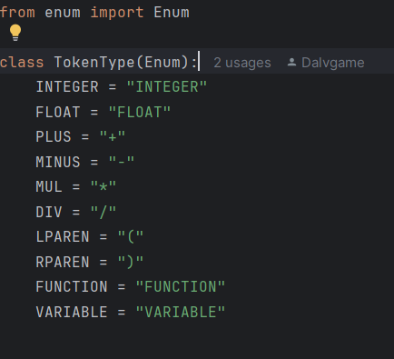
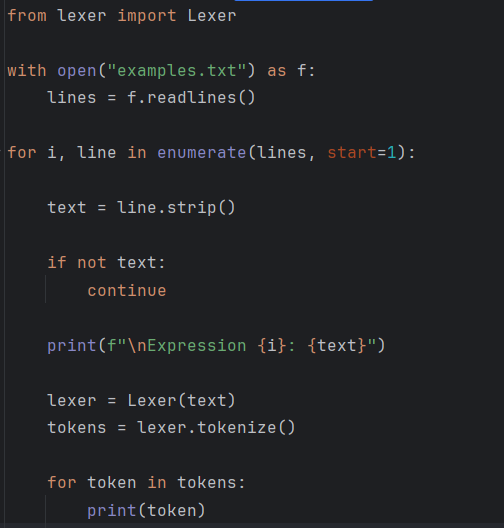
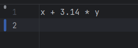
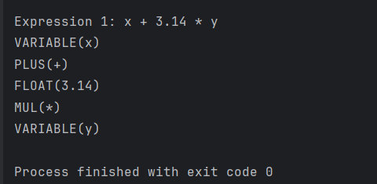

# Lexer/Scanner Implementation

## Course
Formal Languages & Finite Automata

## Author
Vladislav Cuibari

---

# Theory

Lexical analysis is the first stage of a compiler or interpreter. During this phase, a program called a **lexer** (or tokenizer/scanner) reads a sequence of characters and divides it into meaningful units called **tokens**.

A **lexeme** represents the actual sequence of characters found in the input, while a **token** represents the category or type assigned to that lexeme. For example, the lexeme `45` could correspond to the token `INTEGER`.

The lexer simplifies the next stages of program processing by converting raw text into structured elements that can be more easily analyzed by a parser.

---

# Objectives

- Understand the concept of **lexical analysis**.
- Learn how a **lexer/tokenizer** works internally.
- Implement a **simple lexer in Python**.
- Demonstrate how an input expression can be transformed into tokens.

---

# Implementation Description

The project was implemented in Python and consists of several components.

### Token Types

The file `token_types.py` defines the possible token categories using an enumeration. These include integers, floating point numbers, operators, parentheses, functions, and variables. This structure helps standardize the tokens generated by the lexer.

### Lexer

The `lexer.py` file contains the main logic for lexical analysis. The lexer uses **regular expressions** to define patterns for different types of tokens such as numbers, operators, and functions. It scans the input string from left to right and matches substrings against these patterns.

When a match is found, the lexer creates a **Token object** containing the token type and its corresponding value.

### Main Program

The `main.py` file demonstrates how the lexer works. It defines an input expression, creates a lexer instance, and prints the tokens generated from the input.

---
# Code Snippets

## token_types.py

---

## lexer.py

    import re
    from token_types import TokenType

    class Token:
      def __init__(self, type, value):
        self.type = type
        self.value = value

    def __repr__(self):
        return f"{self.type.name}({self.value})"

    class Lexer:

    token_specification = [
        ('FLOAT', r'\d+\.\d+'),
        ('INTEGER', r'\d+'),
        ('FUNCTION', r'sin|cos|tan'),
        ('PLUS', r'\+'),
        ('MINUS', r'-'),
        ('MUL', r'\*'),
        ('DIV', r'/'),
        ('LPAREN', r'\('),
        ('RPAREN', r'\)'),
        ('VARIABLE', r'[a-zA-Z]+'),
        ('SKIP', r'[ \t]+'),
    ]

    def __init__(self, text):
        self.text = text

    def tokenize(self):

        tokens = []

        regex = '|'.join(f'(?P<{name}>{pattern})'
                         for name, pattern in self.token_specification)

        for match in re.finditer(regex, self.text):

            kind = match.lastgroup
            value = match.group()

            if kind == 'SKIP':
                continue

            tokens.append(Token(TokenType[kind], value))

        return tokens

---

## main.py

# Results / Output

## Input

The lexer reads mathematical expressions from a text file (`examples.txt`).  
An example of the input used for testing is shown below.

---

## Output

After processing the input, the lexer identifies the lexemes and converts them into tokens.  
The output produced by the program is shown below.

# Conclusion

In this laboratory work, a lexical analyzer (lexer) was implemented in Python to demonstrate the process of lexical analysis in programming language processing. The lexer reads mathematical expressions from an input file and separates them into lexemes, which are then classified into token types such as numbers, operators, functions, and variables.

Through this implementation, the fundamental concept of transforming raw text into structured tokens was explored. This step is essential in the compilation process because it simplifies further analysis performed by parsers and interpreters.

The project illustrates how regular expressions can be used to efficiently recognize patterns in text and generate tokens. Overall, this work provided practical insight into the role of lexical analysis within the broader context of formal languages and compiler design.