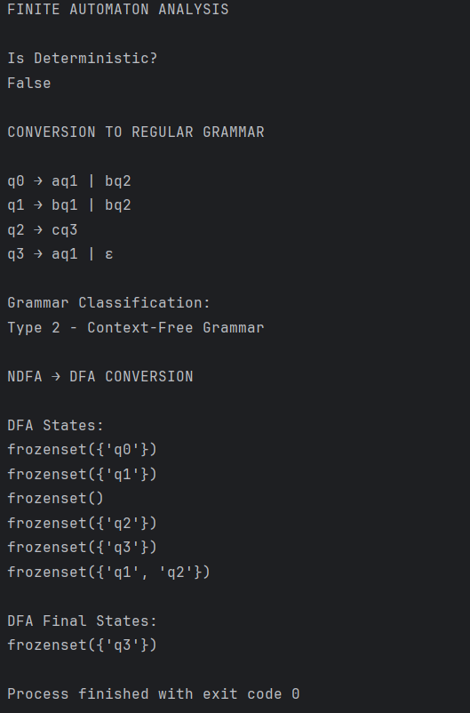
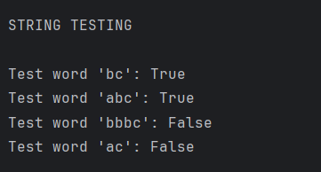

Laboratory Work 2

Course: Formal Languages & Finite Automata
Author: Cuibari Vladislav FAF-243

Theory

A finite automaton is a mathematical model used to recognize formal languages. It consists of a finite set of states, an alphabet, a transition function, a start state, and a set of final (accepting) states. When an input string is processed symbol by symbol, the automaton moves between states according to the transition function. If the automaton ends in a final state after consuming the entire string, the string is accepted.

Finite automata can be deterministic (DFA) or non-deterministic (NDFA). In a DFA, each state and input symbol pair leads to exactly one next state. In an NDFA, a state and symbol may lead to multiple possible next states. Although NDFA and DFA differ structurally, they are equivalent in expressive power. Any NDFA can be converted into an equivalent DFA using the subset construction algorithm.

Regular grammars (Type 3 in the Chomsky hierarchy) are equivalent to finite automata. A finite automaton can be converted into a right-linear grammar by transforming transitions into production rules.

Objectives

Understand the structure and behavior of a finite automaton.

Classify a grammar according to the Chomsky hierarchy.

Convert a finite automaton into a regular grammar.

Determine whether the given finite automaton is deterministic or non-deterministic.

Implement the subset construction algorithm to convert an NDFA into a DFA.

Structure the implementation using multiple Python files and OOP principles.

Variant 10 – Finite Automaton Definition

Q = {q0, q1, q2, q3}
Σ = {a, b, c}
F = {q3}

Transitions:

δ(q0,a) = q1
δ(q0,b) = q2
δ(q1,b) = q2
δ(q1,b) = q1
δ(q2,c) = q3
δ(q3,a) = q1

Because δ(q1,b) leads to two states (q1 and q2), the automaton is non-deterministic.

Implementation Description

The project is structured into three Python files:

finite_automaton.py
grammar.py
main.py
1. FiniteAutomaton Class

This class models the finite automaton. It stores:

states

alphabet

transition function

start state

final states

It implements three main methods:

is_deterministic()

Checks whether any transition leads to more than one state.

def is_deterministic(self):
    for (state, symbol), next_states in self.transitions.items():
        if len(next_states) > 1:
            return False
    return True

If any transition has multiple next states, the automaton is NDFA.

to_regular_grammar()

Converts the automaton into a right-linear grammar.

For each transition:
δ(qi, a) = qj

We add:
qi → a qj

If a state is final, we add:
qf → ε

def to_regular_grammar(self):
    from grammar import Grammar
    productions = defaultdict(list)

    for (state, symbol), next_states in self.transitions.items():
        for next_state in next_states:
            productions[state].append(symbol + next_state)

    for final_state in self.final_states:
        productions[final_state].append("ε")

    return Grammar(
        non_terminals=self.states,
        terminals=self.alphabet,
        productions=productions,
        start_symbol=self.start_state
    )
to_dfa()

Implements subset construction.

Each DFA state represents a set of NDFA states using frozenset.

def to_dfa(self):
    start = frozenset([self.start_state])
    unprocessed = [start]
    dfa_states = [start]
    dfa_transitions = {}
    dfa_final_states = []

    while unprocessed:
        current = unprocessed.pop()

        for symbol in self.alphabet:
            next_set = set()

            for state in current:
                if (state, symbol) in self.transitions:
                    next_set.update(self.transitions[(state, symbol)])

            next_frozen = frozenset(next_set)
            dfa_transitions[(current, symbol)] = next_frozen

            if next_frozen not in dfa_states:
                dfa_states.append(next_frozen)
                unprocessed.append(next_frozen)

    for state_set in dfa_states:
        if any(state in self.final_states for state in state_set):
            dfa_final_states.append(state_set)

    return dfa_states, dfa_transitions, start, dfa_final_states
2. Grammar Class

This class models a formal grammar and classifies it according to the Chomsky hierarchy.

classify()

Checks whether productions respect regular grammar rules:

A → aB

A → a

A → ε

def classify(self):
    is_regular = True
    is_context_free = True

    for left, rights in self.productions.items():
        if left not in self.non_terminals:
            is_context_free = False
            is_regular = False

        for right in rights:
            if right == "ε":
                continue

            if len(right) == 2:
                if not (right[0] in self.terminals and right[1:] in self.non_terminals):
                    is_regular = False
            elif len(right) == 1:
                if right not in self.terminals:
                    is_regular = False
            else:
                is_regular = False

    if is_regular:
        return "Type 3 - Regular Grammar"
    elif is_context_free:
        return "Type 2 - Context-Free Grammar"
    else:
        return "Type 0/1 - More General Grammar"

For our variant, the grammar is classified as:

Type 3 – Regular Grammar

3. Main File

The main file instantiates the automaton using Variant 10 and executes all required functionality.

def main():

    states = {"q0", "q1", "q2", "q3"}
    alphabet = {"a", "b", "c"}

    transitions = {
        ("q0", "a"): {"q1"},
        ("q0", "b"): {"q2"},
        ("q1", "b"): {"q1", "q2"},
        ("q2", "c"): {"q3"},
        ("q3", "a"): {"q1"},
    }

    start_state = "q0"
    final_states = {"q3"}

    fa = FiniteAutomaton(states, alphabet, transitions, start_state, final_states)

    print("Is Deterministic?", fa.is_deterministic())

    grammar = fa.to_regular_grammar()
    grammar.print_productions()
    print("Grammar Classification:", grammar.classify())

    dfa_states, dfa_transitions, dfa_start, dfa_finals = fa.to_dfa()
Results

Program Output:

  
  
Figure 1 - Output results

 

  
 
Figure 2 - Output results string testing

 
 

**Difficulties During Implementation**

During the completion of this laboratory work, several conceptual and technical challenges were encountered.

One of the main conceptual difficulties was understanding the subset construction algorithm used to convert an NDFA into a DFA. The idea that a single DFA state represents a set of NDFA states required careful reasoning. Initially, it was not intuitive why combining states guarantees determinism. After analyzing the transition behavior step by step, it became clear that each DFA transition must lead to exactly one set of states, ensuring deterministic behavior.

Another difficulty was handling non-deterministic transitions correctly in code. Since transitions may lead to multiple states, sets had to be used to store next states. Additionally, Python dictionaries require hashable keys, which meant that normal sets could not be used directly. This led to the use of frozenset, which allows sets to be used as dictionary keys. Understanding this implementation detail was essential for correctly implementing the DFA conversion.

Classifying the grammar according to the Chomsky hierarchy also required attention. The implementation needed to correctly verify whether productions followed the strict format of right-linear rules. Careful validation of each production was necessary to ensure proper classification.

Finally, structuring the project into multiple files while maintaining correct imports required attention to modular design principles. Separating the FiniteAutomaton and Grammar classes improved clarity but required careful management of dependencies between modules.

These challenges contributed to a deeper understanding of the theoretical concepts behind finite automata and regular grammars, as well as their practical implementation in Python.

**Conclusions**

This laboratory work extended the previous implementation by focusing on finite automata analysis and transformation. The given automaton was identified as non-deterministic due to multiple transitions for the same state and symbol. The automaton was successfully converted into an equivalent regular grammar, confirming the theoretical equivalence between finite automata and regular grammars.

The subset construction algorithm was implemented to transform the NDFA into an equivalent DFA. The implementation follows object-oriented principles and separates responsibilities into distinct classes, improving clarity and modularity.

The results demonstrate both the theoretical concepts and their practical application in Python.